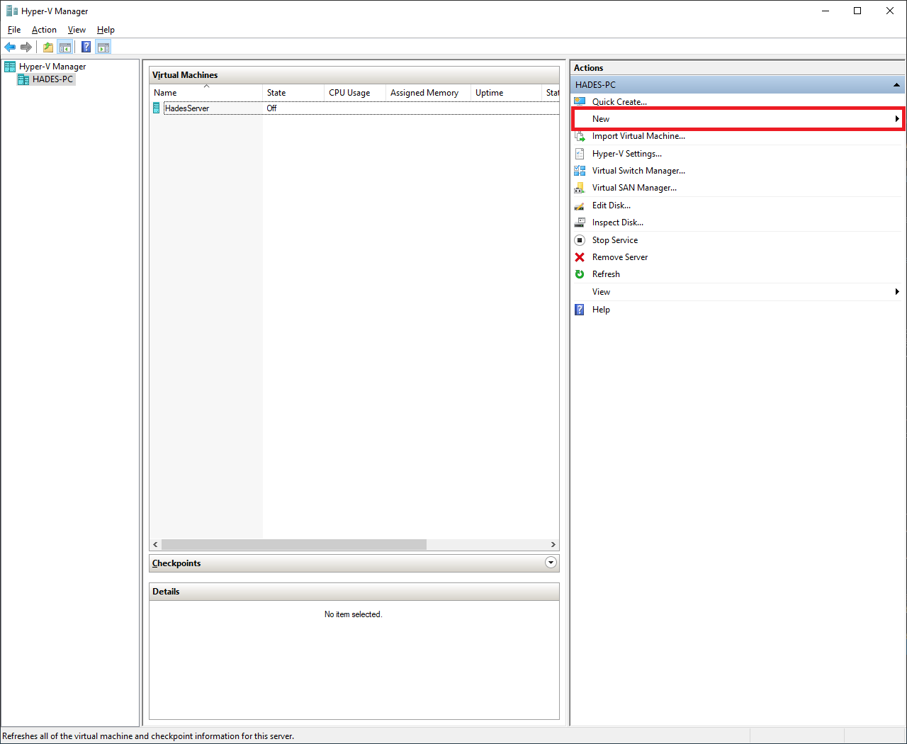
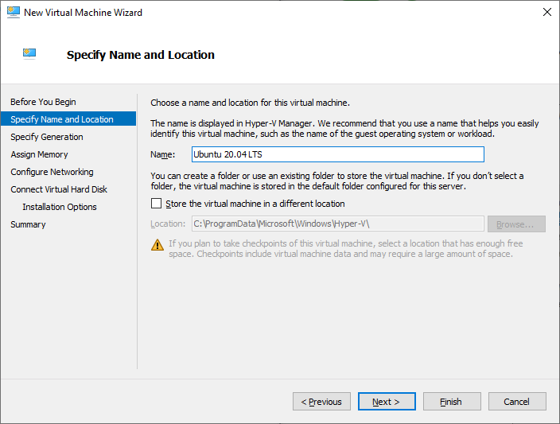
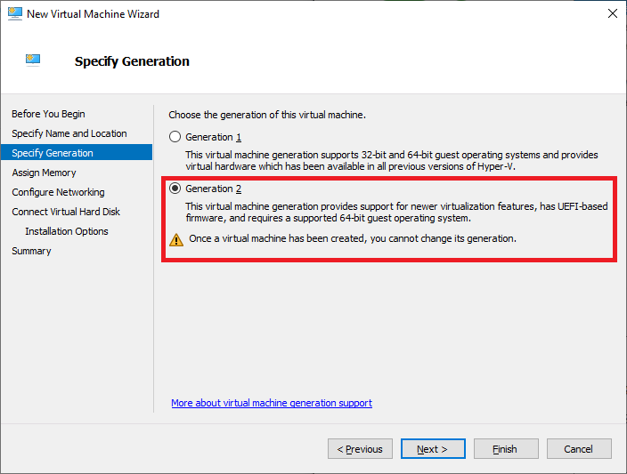
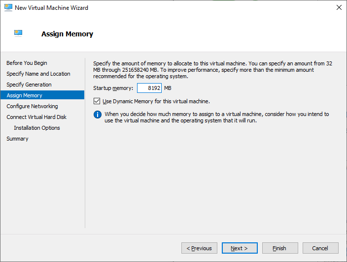
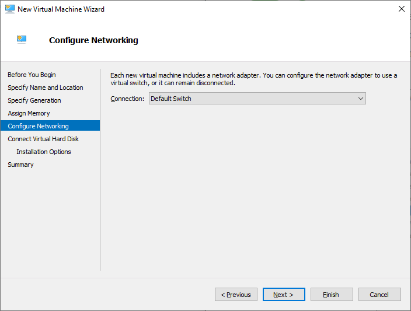
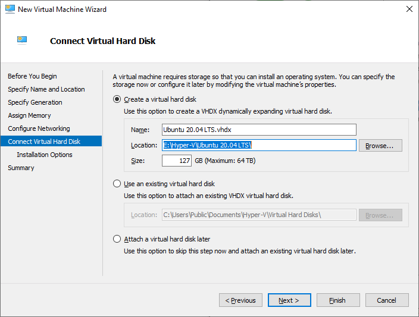
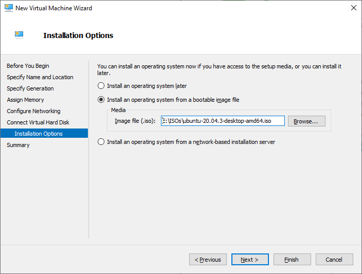
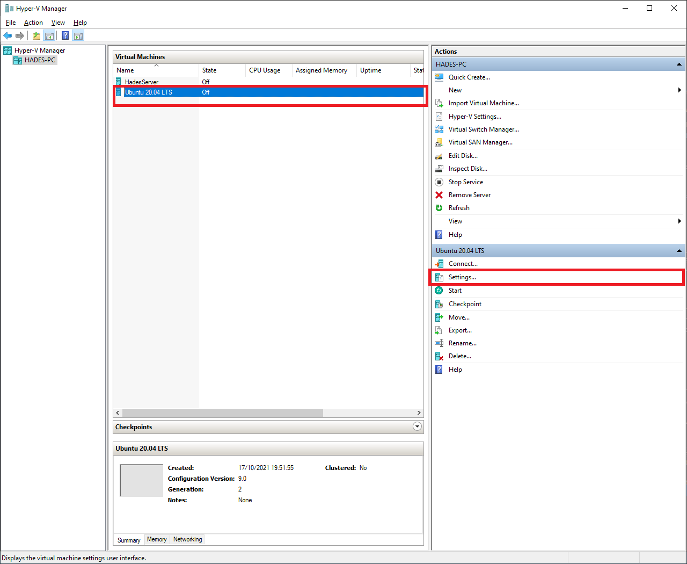
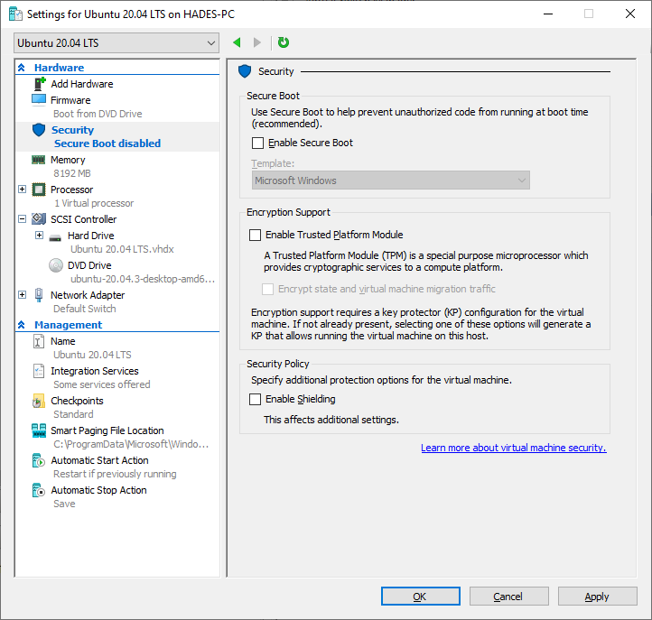
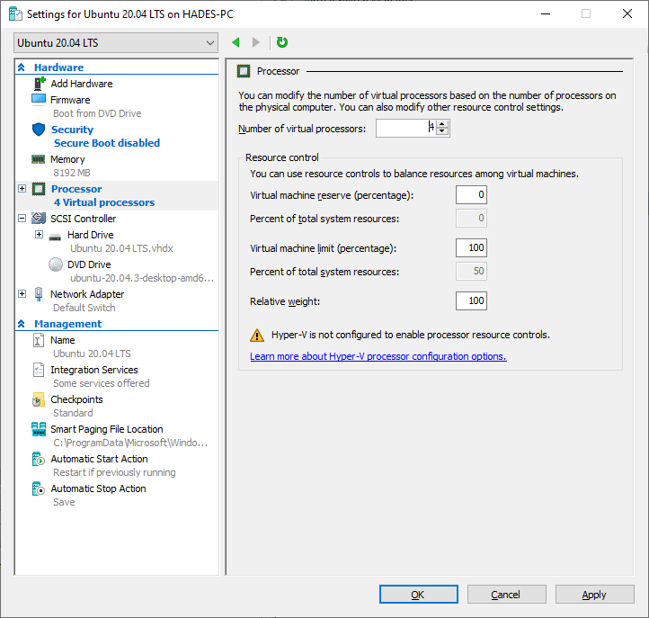

# How to install Ubuntu 20.XX on Hyper-V

## Create a VM
1. Open the "Hyper-V Manager" and on the right panel click on ""New"", then "Virtual Machine".

    

2. A new window will appear. Choose an appropriate name for your VM and click "Next".

    

3. Make sure you select "Generation 2" on the next page. This will ensure that UEFI is enabled. Then, click "Next".

    

4. As for the amount of memory, 4GB is the minimum requirement for a good experience. I suggest you to go to 8GB if you can. Then, click "Next".

    

5. Be sure to select at least one network interface so that Ubuntu can download updates while installing and later on we can download drivers too. Then, click "Next".

    

6. By default the wizard will create a 127GB disk. For my purpose that amount of storage is enough. Then, you guessed it, click "Next".

    

7. Last but not least, select the ISO downloaded from the Ubuntu website. To end the wizard, click on "Finish".

    

8. Before you can start the VM, we have to disable secure boot as Ubuntu doesn’t support it. Select the VM, then on the right panel click "Settings".

    

9. On the left panel click "Security" and make sure that "Enable secure boot" is unchecked. Then, click "Ok".

    

10. On the left panel click "Processor", if you have a multi-core processor, I recommend using 4 for good performance.

    

**We are now ready to start the VM and run the OS setup (remember to don’t enable auto-login, otherwise the enhanced session won’t work). Once you have finished, we can start installing the "linux-tools" provided by Microsoft.**

## Setup enhanced session

### On Ubuntu, open a terminal, download and run the setup script.

```
wget https://raw.githubusercontent.com/Microsoft/linux-vm-tools/master/ubuntu/18.04/install.sh
sudo chmod +x install.sh
sudo ./install.sh
```

- If you receive an error at the end of the install script, there is one more thing to do. Using your favorite editor, open /etc/xrdp/xrdp.ini (sudo required) and add or edit the following lines:
```
port=vsock://-1:3389
use_vsock=false
```

- Save the file and shutdown the VM. From Windows, open a PowerShell prompt with admin privileges and type:
```
Set-VM -VMName <your_vm_name>  -EnhancedSessionTransportType HvSocket`
```

- Where `<your_vm_name>` is, well, the name of the VM (the one chosen at the start of the creation wizard).

- There you go! Now start the VM and in a matter of seconds you will be redirected to the XRDP login page.